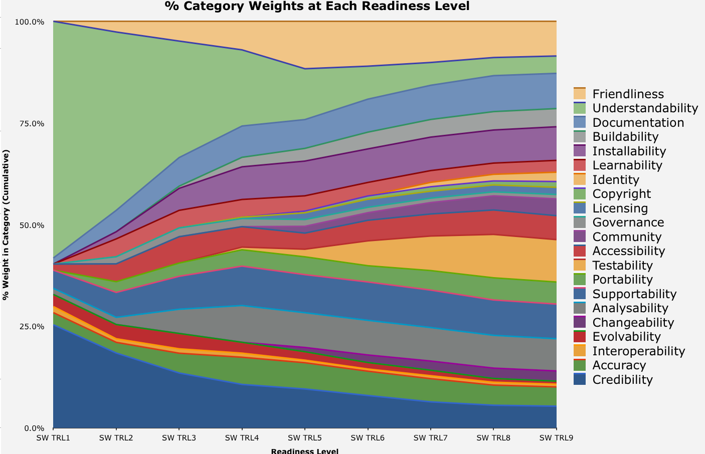

### TRL Spreadsheet ###

**Category Weights by TRL Level**

See the [final report](http://wiki.esipfed.org/images/7/73/ESIP_Technology_Evaluation_Framework_Recommendations.pdf), provided by John Graybeal, and [presentation](http://wiki.esipfed.org/images/7/7d/ESIP_Technology_Evaluation_Framework_Recommendations_Slides.pdf). Provided here for easier access.

Brief context: this is a combination of the Software Sustainability evaluation criteria and the NASA AIST TRL. For our current discussions, it is a useful starting point to ask what's missing, what is a generic readiness progression, what can be evaluated, etc. 

See the [Questions](FeatureWeights.html) for the complete list of evaluation questions with weights by TRL for the blow-by-blow.

